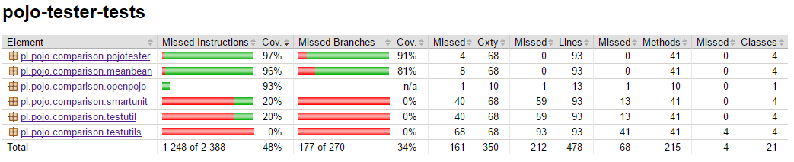

# Comparison
Here you can compare pojo-tester to existing java libraries that test `pojo-methods`.

## Other libraries {#other-libs}
Here is the list of libraries that were found on the Internet. If you find another one, feel free to write a comparison and include it into your pull request.

* pojo-tester 0.5.0
* [openpojo](http://openpojo.com) 0.8.4
* [SmartUnit](https://github.com/rlogiacco/SmartUnit) 0.10.2
* [testUtils](http://outsidemybox.github.io/testUtils/index.html) 0.1.3
* [testUtil](http://gtcgroup.com/testutil.html) 2.2
* [meanBean](http://meanbean.sourceforge.net/) 0.1.3

## Tests Preconditions {#precondtioions}
Tests are performed on `pojo-classes`. 

Every framework is tested against several classes, each using different `pojo-methods` generation mechanism:
[Lombok](https://projectlombok.org/), 
[Apache's commons lang 3](https://commons.apache.org/proper/commons-lang/),
[Google's guava](https://github.com/google/guava) and
standard IntelliJ method generation.

Code coverage is measured using [JaCoCo 0.7.7.201606060606](http://www.eclemma.org/jacoco/).

Classes contains fields as shown below:

```java
public class Pojo {
    private int a;
    private float b;
    private String c; 
    //  generated methods
}
```

## Kind of tests {#kind-of-tests}
Each library provides different testing features. Here is the comparison.

### Features comparision

Basic `pojo-methods` test support:

| Kind of tests                                | pojo-tester    | OpenPojo       | SmartUnit       | testUtils       | testUtil        | Mean Bean        |
|---                                           |:---:           |:---:           |:---:            |:---:            |:---:            |:---:             |
| getters                                      | &#10003        | &#10003        | &#10003^        | &#10003         | &#10003^        | &#10003          |
| setters                                      | &#10003        | &#10003        | &#10003^        | &#10003         | &#10003^        | &#10003          |
| equals                                       | &#10003        | &#10003*^      | &#10005         | &#10003         | &#10005         | &#10003^         |
| hashCode                                     | &#10003        | &#10003*^      | &#10005         | &#10003         | &#10005         | &#10003^         |
| toString                                     | &#10003        | &#10003*^      | &#10005         | &#10003         | &#10005         | &#10005          |
| constructors                                 | &#10003        | &#10005        | &#10005         | &#10005         | &#10005         | &#10005          |
||||||||
|                                                         Additional features                                              |
| field selection                              | &#10003              | &#10003        | &#10003         | &#10003         | &#10005         | &#10003          |
| method selection                             | &#10003              | &#10003        | &#10005         | &#10005         | &#10005         | &#10003          |
| supports nonpublic classes                   | &#10003              | &#10003        | &#10005         | &#10003         | &#10005         | &#10005          |
| supports non-default constructors            | &#10003              | &#10003        | &#10005         | &#10003         | &#10005         | &#10005          |
| recurrence support                           | &#10003              | &#10005        | &#10005         | &#10005         | &#10005         | &#10005          |
| creating object by user defined constructor  | &#10003              | &#10005        | &#10005         | &#10005         | &#10005         | &#10005          |
| custom changing fields values                | &#10003              | &#10005        | &#10005         | &#10005         | &#10005         | &#10005          |
| package-testing                              | &#10003              | &#10003        | &#10005         | &#10005         | &#10005         | &#10005          |

\* limited support for changing fields recursively and otherwise having problems with fields other than primitives. 

^ requires additional changes in your production code

### Tests

#### `POJO-TESTER`
To test all classes using `POJO-TESTER` we have to write code as follows:
```java
@Test
public void Should_Test_Pojo() {
    // given
    final Class[] classesUnderTest = {Pojo_Guava_Generated_Methods.class,
                                      Pojo_Apache_Generated_Methods.class,
                                      Pojo_Lombok_Generated_Methods.class,
                                      Pojo_Standard_Generated_Methods.class};
    // when

    // then
    assertPojoMethodsForAll(classesUnderTest).areWellImplemented();
}
```
That's all. No matter what `getter`, `setter`, `equals`, `hashCode` or `toString` method implementation you use your classes will be tested!


#### OpenPojo
We actually cannot test all classes using openpojo, because this library requires special `hashCode`, `equals` and `toString` method implementation.
So instead we will test just one `pojo` class.
First of all, we need to modify our `pojo` class by adding special annotation `@BusinessKey` to each field we want to be tested.
Furthermore we have to delegate `hashCode`, `equals` and `toString` method to `BusinessIdentity`.

Our modified `pojo` class looks like this:
```java
class Pojo_Standard_Generated_Methods {

    @BusinessKey(caseSensitive = false)
    private int a;

    @BusinessKey(caseSensitive = false)
    private float b;

    @BusinessKey(caseSensitive = false)
    private String c;

    @Override
    public String toString() { return BusinessIdentity.toString(this); }

    @Override
    public boolean equals(final Object o) { return BusinessIdentity.areEqual(this, o); }
    
    @Override
    public int hashCode() { return BusinessIdentity.getHashCode(this); }
    
    // standard getters and setters
}
```


In order to perform tests we have to write code as shown below:

```java
@Test
public void Should_Test_Pojo() {
    final Validator validator = ValidatorBuilder.create()
                                                .with(new SetterMustExistRule())
                                                .with(new GetterMustExistRule())
                                                .with(new BusinessKeyMustExistRule())
                                                .with(new SetterTester())
                                                .with(new GetterTester())
                                                .with(new BusinessIdentityTester())
                                                .build();

    final Class<?> classUnderTest = Pojo_Standard_Generated_Methods.class;
    final ArrayList<PojoField> pojoFields = new ArrayList<>(PojoFieldFactory.getPojoFields(classUnderTest));
    final List<PojoMethod> pojoMethods = PojoMethodFactory.getPojoMethods(classUnderTest);
    final PojoClassImpl pojoClass = new PojoClassImpl(classUnderTest, pojoFields, pojoMethods);

    validator.validate(pojoClass);
}
```


#### SmartUnit
In order to test classes using SmartUnit we don't have to provide any modifications.

So our test is listed below:

```java
@Test
public void Should_Test_Pojo() throws Exception {
    // given
    final Class[] classesUnderTest = {Pojo_Guava_Generated_Methods.class,
                                      Pojo_Apache_Generated_Methods.class,
                                      Pojo_Lombok_Generated_Methods.class,
                                      Pojo_Standard_Generated_Methods.class};

    final PropertiesTester propertiesTester = new PropertiesTester();
    // when

    // then
    for (final Class classUnderTest : classesUnderTest) {
        propertiesTester.testAll(classUnderTest);
    }
}
```

#### testUtils
At first glance, this library could compete with `POJO-TESTER` and OpenPojo, but we were unable to run tests getting exception:

We tried our best, so there is nothing we can do but paste the attempted test code:
```java
@Test
public void Should_Test_Pojo() {
    // given
    final Class[] classesUnderTest = {Pojo_Guava_Generated_Methods.class,
                                      Pojo_Apache_Generated_Methods.class,
                                      Pojo_Lombok_Generated_Methods.class,
                                      Pojo_Standard_Generated_Methods.class};
    // when

    // then
    for (final Class classUnderTest : classesUnderTest) {
        // 1. Define the default values expected:
        final BeanLikeTester.PropertiesAndValues defaultValues = new BeanLikeTester.PropertiesAndValues();
        defaultValues.put("a", 1);
        defaultValues.put("b", 2);
        defaultValues.put("c", "string");

        // 2. Give another value for each of the properties:
        final BeanLikeTester.PropertiesAndValues otherValues = new BeanLikeTester.PropertiesAndValues();
        otherValues.put("a", 3);
        otherValues.put("b", 4);
        otherValues.put("c", "otherString");

        // 3. Create the tester:
        final BeanLikeTester.ConstructorSignatureAndPropertiesMapping constructorsSignaturesAndProperties = new BeanLikeTester
                .ConstructorSignatureAndPropertiesMapping();
        constructorsSignaturesAndProperties.put(Collections.emptyList(), Collections.emptyList());
        final BeanLikeTester blt = new BeanLikeTester(classUnderTest, constructorsSignaturesAndProperties);

        // 4a. Test the bean's methods:
        // blt.testDefaultValues(defaultValues);
        // blt.testMutatorsAndAccessors(defaultValues, otherValues);
        // blt.testEqualsAndHash(defaultValues, otherValues);
        // blt.testToString(defaultValues, otherValues);

        // 4b. Or test everything at once.
        blt.testBeanLike(defaultValues, otherValues);

        // 5. Check the code coverage. The method equals() may not have been totally covered.
        // In this case create another set of values and run testEqualsAndHash() against it:
        otherValues.put("a", null);
        otherValues.put("b", true);
        otherValues.put("c", 0L);
        blt.testEqualsAndHash(defaultValues, otherValues);

    }
}
```

#### testUtil
This library does not allow to test classes, so we have to create instances.

Test looks as follows:

```java
@Test
public void Should_Test_Pojo() {
    // given
    final Object[] classesUnderTest = {new Pojo_Guava_Generated_Methods(),
                                       new Pojo_Apache_Generated_Methods(),
                                       new Pojo_Lombok_Generated_Methods(),
                                       new Pojo_Standard_Generated_Methods()};
    // when

    // then
    Arrays.stream(classesUnderTest)
          .forEach(TestUtil::verifyMutable);
}
```

#### Mean Bean
Testing `pojos` using Mean Bean is almost as easy as using `POJO-TESTER` or OpenPojo. But we have to create three testers:

```java
@Test
public void Should_Test_Pojo() {
    // given
    final Class[] classesUnderTest = {Pojo_Guava_Generated_Methods.class,
                                      Pojo_Apache_Generated_Methods.class,
                                      Pojo_Lombok_Generated_Methods.class,
                                      Pojo_Standard_Generated_Methods.class};
    // when

    // then
    final HashCodeMethodTester hashCodeMethodTester = new HashCodeMethodTester();
    final EqualsMethodTester equalsMethodTester = new EqualsMethodTester();
    final BeanTester beanTester = new BeanTester();
    Arrays.stream(classesUnderTest)
          .forEach(classUnderTest -> {
              hashCodeMethodTester.testHashCodeMethod(classUnderTest);
              equalsMethodTester.testEqualsMethod(classUnderTest);
              beanTester.testBean(classUnderTest);
          });
}
```

## Coverage Comparison {#coverage-comparison}
OK! Now let us look at the coverage. 

First of all, three libraries (Smart Unit, testUtil and testUtils) have lowest code coverage as they test only getters and setters.

Next is Open Pojo, loosing the fight only against Mean Bean and `POJO-TESTER`.
Open Pojo cannot test classes that implement custom `equals`, `hashCodes` and `toString`, so you cannot use it in your existing project without prior production code modifications.

Mean Bean looks pretty nice, but due to its implementation the coverage is unstable. 
Mean Bean generates `pojo`'s fields values randomly, so you can have lower or higher coverage, but always below `POJO-TESTER` level. 
And there is one more thing. Tests (internal, in library implementation) using Mean Beans are repeated hundred times, by default.

`POJO-TESTER` does the job. It provides stable coverage with the highest percentage. See numbers below.


We have done one more code coverage report using changing nested fields. 
From those tests we excluded three libraries - Mean Bean, Smart Unit and TestUtil.
They simply could not perform such tests and threw undefined exceptions.

Here are results:

## Conclusions {#conclusions}

Here is a quick overview of tests. 

Libraries like `testUtil`, `testUtils`, and `smart-unit` are just outdated. 
No one is implementing them. (Our definitions of `implement` is the more bugs are reported the more library is up to date).
Those libraries test only `setters` and `getters`, which are the least wanted and the least liable for bugs.
One good thing about testUtils that other libraries miss is really nice logs.

OK. Let us see who is the boss.

Let us start from Open Pojo.

The biggest disadvantage of this library is that it needs to be a `compile dependency`, which means that when you build a `fatJar` this library will be inside it.
We don't like our test libraries to be included in production code. It also does not support recurrence. 
Furthermore `equals`, `hashCode` and `toString` methods implementation needs to be delegated to this library, which prevents you from hiding fields in `toString` e.g. `userPassword`.

On the other hand, the biggest advantage over `POJO-TESTER` and Mean Bean is that the Open Pojo has more rules.
It can check that class has getters or setters, does not have primitives, public fields or field shadowing.
But say it openly, those are very rarely-used bonuses.

The biggest opponent of `POJO-TESTER` is Mean Bean. Actually, this library has the same advantages as `POJO-TESTER`.

Disadvantages are: 
* it has variable coverage report, which can cause unwanted CI reports
* it does not support recurrence which can be a deal breaker, especially if you use enums or VOs (Value Objects)

Next thing that `POJO-TESTER` can do, but other libraries cannot, is recursively testing fields.
This means your tests are more sure. 

And last but not least which makes `POJO-TESTER` awesome is that it can test constructors! 
Now you can forget about getting constructors via reflection, invoking them... What a nightmare. And who is doing this?
No more reflection in your tests!

To sum up, `POJO-TESTER` has the highest consistent coverage and its features make your tests more bulletproof.
